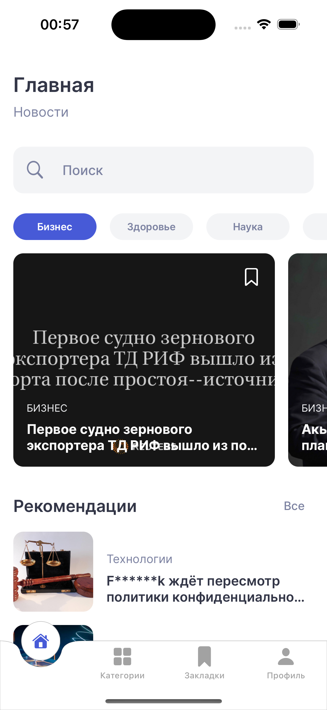
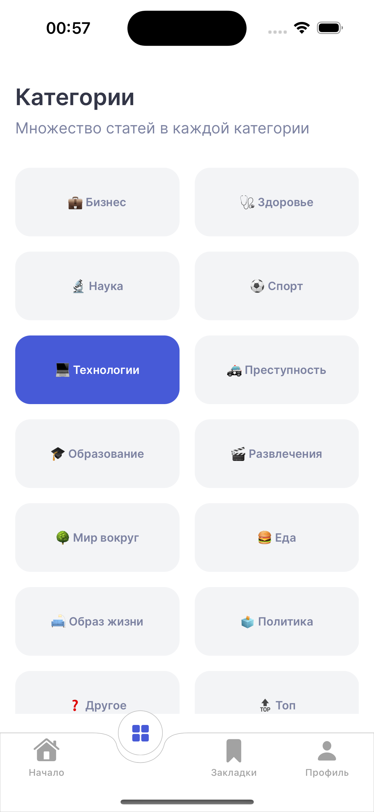
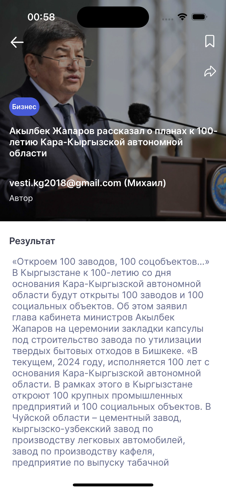

## NewsAppToDay
Будьте всегда в курсе последних событий, читайте актуальные новости, выбирайте то, что интересно вам, сохранйте в избранное.

## Stack: 
- UIKit
- SnapKit
- Firebase

## Особенности:
 - Использование API https://newsdata.io
 - Создание пользовательского профиля
 - Просмотр и поиск интересующих вас новостей
 - Рекомендации на основе ваших предпочтений
 - Выбор новостных категорий
 - Сохранение статей в избранное
 - Смена языка приложения (поддерживаемые языки: Русский, Английский)

## Начало работы:
Чтобы начать работу с NewsViewer, выполните следующие шаги:

1. **Клонировать репозиторий**: Склонируйте этот репозиторий на ваш локальный компьютер с помощью команды `git clone git@github.com:Demogorgonius/NewsToDayApp.git`.
2. **Настройка API**: Зарегистрируйте на https://newsdata.io, получите ключи API настройте их в XCode либо непосредственно в коде приложения.
3. **Сборка и запуск**: Откройте проект в Xcode, выполните сборку и запустите приложение на вашем iOS симуляторе или физическом устройстве.

## Contributors:
- [Polychh](https://github.com/Polychh)
- [Dual-Ice](https://github.com/Dual-Ice)
- [Demogorgonius](https://github.com/Demogorgonius)
- [vesily92](https://github.com/vesily92)
